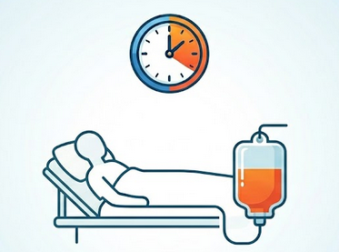

# Estimación temprana de la necesidad de soporte vasopresor con noradrenalina en UCI mediante aprendizaje automático interpretable

Repositorio asociado al Trabajo de Fin de Grado (TFG) orientado al desarrollo, evaluación y validación de modelos de aprendizaje automático para estimar la probabilidad de inicio de soporte vasopresor con noradrenalina en pacientes adultos ingresados en UCI, utilizando variables clínicas y analíticas disponibles durante las primeras horas de estancia.

<p align="center">
  
</p>

El trabajo incluye:
* Construcción de cohortes retrospectivas sobre MIMIC-IV.
* Entrenamiento y validación interna de modelos predictivos.
* Selección de variables e interpretación mediante SHAP.
* Calibración probabilística.
* Validación externa sobre eICU-CRD.
* Desarrollo de un prototipo de dashboard interpretable en Streamlit.
* Documentación académica completa del TFG.

---

## Estructura del repositorio

```text
.
├── Archivo/
├── Dashboard/
├── Memoria/
├── Pipeline/
│   ├── Experimentos/
│   └── FINAL/
└── Validacion_externa/
    └── eICU/
```

### Descripción de carpetas

* **`Memoria/`**: Contiene la documentación académica del TFG.
  * Memoria principal y anexos.
  * Fuentes en Quarto / Markdown (`.qmd`).
  * Figuras e imágenes utilizadas en el documento (`img/`).
* **`Pipeline/FINAL/`**: **Carpeta principal para consultar los resultados de los modelos** Contiene la versión definitiva del flujo experimental utilizada para generar los resultados de la memoria, modelos, tablas y figuras asociadas:
  * Modelos entrenados y tablas de métricas.
  * Curvas de validación interna y de calibración.
  * Figuras SHAP y comparaciones entre modelos/calibradores.
* **`Pipeline/Experimentos/`**: Versiones intermedias del pipeline conservadas por trazabilidad histórica y por contener los pasos para la construcción de las cohortes y selección de variables.
* **`Validacion_externa/eICU/`**: Material relacionado con la validación externa sobre eICU-CRD (scripts, consultas, tablas o figuras utilizados para evaluar los modelos de MIMIC-IV).
* **`Dashboard/`**: Prototipo de la aplicación web desarrollado en Streamlit.
* **`Archivo/`**: Pruebas preliminares y versiones antiguas del desarrollo de cohortes conservadas por trazabilidad histórica.

---

## Flujo general del proyecto

El proceso metodológico seguido en el TFG se divide en las siguientes etapas:

1. **Definición de ventanas temporales** de observación y predicción.
2. **Construcción de cohortes** sobre la base de datos MIMIC-IV.
3. **Identificación del evento objetivo**: inicio del tratamiento con noradrenalina.
4. **Selección y reducción** del espacio de variables predictoras (constantes vitales y analíticas).
5. **Entrenamiento de modelos** de aprendizaje automático y validación cruzada anidada.
6. **Evaluación de rendimiento** mediante métricas de discriminación, calibración y rendimiento probabilístico.
7. **Calibración** de los modelos seleccionados.
8. **Análisis de interpretabilidad** local y global mediante valores SHAP.
9. **Comparación** del rendimiento predictivo frente a la escala clínica SOFA.
10. **Validación externa** sobre la base de datos eICU-CRD.
11. **Integración** de los resultados en un dashboard interactivo.

---

## Modelos evaluados

Se evaluaron seis algoritmos de aprendizaje supervisado sobre datos tabulares:
* Regresión Logística
* Naive Bayes Gaussiano
* Random Forest
* XGBoost
* LightGBM
* CatBoost

La selección final de los modelos se basó en una combinación equilibrada de rendimiento discriminativo, rendimiento probabilístico, calibración, estabilidad e interpretabilidad clínica.

---

## Prototipo de Dashboard (Streamlit)

El dashboard interactivo tiene como objetivo mostrar de forma gráfica e interpretable la salida de los modelos entrenados. Permite:
* Cargar datos clínicos en formato `.csv`.
* Seleccionar una ventana temporal de análisis.
* Calcular la probabilidad estimada de inicio de noradrenalina.
* Visualizar el riesgo del paciente de forma contextualizada.
* Ofrecer una explicación local e individualizada de las variables mediante **SHAP**.

---

## Datos clínicos y Reproducibilidad

Debido a estrictas restricciones de uso y privacidad, los datos originales de MIMIC-IV y eICU-CRD no se incluyen en este repositorio.

Para reproducir completamente este análisis es necesario:
1. Realizar el curso de Ética en Investigación con Datos Humanos de CITI Program, disponer de acceso autorizado a PhysioNet y cumplir los acuerdos de uso correspondientes.
2. Contar con un entorno de Python compatible (versión 3.12 en adelante)
3. Descargar las bases de datos originales y adaptar las rutas locales en los scripts de la carpeta `Pipeline`.

La reproducción del trabajo puede entenderse en dos niveles:

- **Consulta de resultados finales**: la carpeta principal es `Pipeline/FINAL/`, donde se encuentran los modelos entrenados, tablas, figuras, curvas de calibración, gráficos OOF y análisis SHAP utilizados en la memoria.
- **Trazabilidad del desarrollo**: la carpeta `Pipeline/Experimentos/` conserva las versiones intermedias que documentan la construcción de cohortes, consultas, selección de variables y decisiones metodológicas previas a la versión final.

La carpeta `Archivo/` contiene pruebas preliminares más antiguas y no constituye la referencia principal para interpretar los resultados finales.

---

## **AVISO MUY IMPORTANTE**
Este proyecto tiene una finalidad estrictamente académica e investigadora en el marco de un Trabajo de Fin de Grado. Los modelos desarrollados y el dashboard son prototipos experimentales, **no están validados prospectivamente, no cuentan con autorización regulatoria y NO deben utilizarse bajo ninguna circunstancia para la toma de decisiones clínicas reales ni asistenciales.** No emiten recomendaciones terapéuticas ni proponen dosis; no sustituyen en ningún caso la valoración de un profesional médico.
